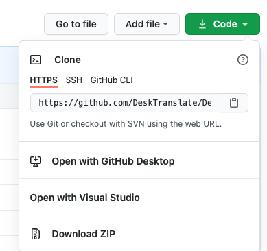

# Welcome to DeskTranslate!

## Links
|:information_source:  | [Our Website](https://desktranslate.github.io/DeskTranslate/)   |
|---------------|:------------------------|

|:information_source:  | [User Guide](https://desktranslate.github.io/DeskTranslate/UserGuide.html)   |
|---------------|:------------------------|

|:information_source:  | [Devpost Link](https://devpost.com/software/desktranslate)   |
|---------------|:------------------------|

## macOS users
Please visit [DeskTranslate-Mac](https://github.com/DeskTranslate/DeskTranslate-Mac) for installation instructions for macOS

## Quick Start

### Using our installer

#### Releases of DeskTranslate can be found [here](https://github.com/DeskTranslate/DeskTranslate/releases/tag/1.1a).  

The installer will set up `DeskTranslate` first.

Once complete, it will launch another installer for [Tesseract](https://github.com/UB-Mannheim/tesseract/wiki).

> Installation of Tesseract is required to use DeskTranslate

Components: ScrollView, Training Tools and Shortcut creation are not required. 

Feel free to uncheck them to reduce download size.

If only 1 translation language is needed i.e. English to / from Japanese, check the corresponding data.

In this case, under both the `Additional script data (download)` and `Additional language data (download)`, select 
- Japanese
- Japanese (Vertical)

- 

In total, 5 checkboxes need to be checked to use it for Japanese translation. 

> Apply the above steps for the languages required

### Downloading from our repo [for developers]

1. To get started, download DeskTranslate at our main repo by clicking Code -> Download ZIP.

2. Ensure Python is install in your computer.

3. Using terminal, go to the directory where the repo is downloaded to. 

4. Download the libraries required:  
`pip install -r requirements.txt`

5. Visit [this link](https://github.com/UB-Mannheim/tesseract/wiki) to download Tesseract v5.0.0, in order 
for our program to work on your computer.

6. At the installation wizard, check all boxes to ensure that all language training data will be included for DeskTranslate. 

7. Next, enter the following command to start the program:
`python main.py`

