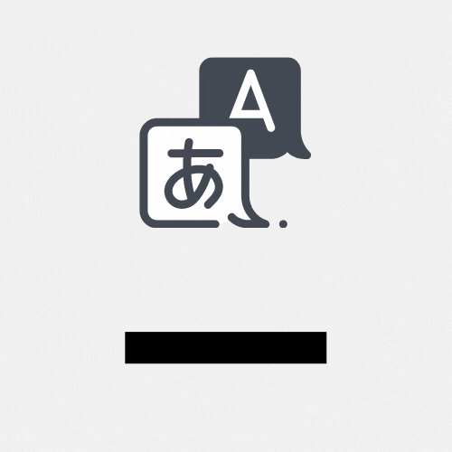

# DeskTranslate

:information_source:  [User Guide](UserGuide.md)  

:information_source:  [Devpost Link](https://devpost.com/software/desktranslate)   

## Inspiration: 

We are in the 21st century, and yet many things we do on our computers are still bound by language barriers. Found an amazing game you wish to play online but it is not in English? You could only wait and hope for it to be translated one day. The same problem applies not just to games, but any form of media and software we use today. 

While awesome, translation software like Google translate only works on either web or the mobile application, but none supports the seamless translation and display of information which a user needs. 

Furthermore, not everything is in copyable text format, you might be trying to read a copyright protected PDF, or perhaps some infographic, making the task of finding the appropriate text to translate an arduous task! This frustration led us to build DeskTranslate.

Vision problems and learning disabilities like dyslexia pose a great challenge for many to read and decipher visual content such as English alphabets. With DeskTranslate, it may assist these people in alleviating their problem by translating these texts to another language (which they can recognise) or even perform text2speech if they prefer an audio experience.

## What it does:

DeskTranslate is a tool which does live translation of any application on your desktop using optical character recognition technology. No longer do you have to break immersion by going through the hassle of copying and pasting foreign text onto Google translate (if it is even possible - as many times words are not being displayed in copy-able format). With DeskTranslate, just sit back and relax as translated text seamlessly gets displayed on your screen.  If your eyes got tired, we got text2speech for you too!

## How we built it:

DeskTranslate is written in Python with:

- PyQt5 for its GUI
- Tkinter for measuring screen dimensions
- Pillow for Screen capture
- cv2 for image processing
- pyTesseract for OCR
- deep_translate for translation
- pyttsx3 for text to speech 

## Challenges we ran into:

- We used Tkinter for our GUI initially, but we had lots of difficulties using it for searching the borders of the screen for translation. It also had a rather complicated process for GUI creation. We decided to switch to PyQt in the end despite having a half-done GUI on Tkinter
- Dealing with multithreading issues as we had to have a functional GUI running simultaneously with many of our background processes for OCR, translation etc. 
- Languages provided by the tesseract OCR functionality did not match the list of languages provided by deep_translate
  - Needed to map the available language packs and respective language codes for respective languages and translation engines

## Accomplishments that we're proud of

- We created something amazing which solves an actual problem
- There is no similar product out there, other than painstakingly manually holding your phone to scan your screen with Google translate
- Creating a decent looking GUI in PyQt5 despite having very little time to learn it
- Designing a professional looking logo

## What we learned

- LOTS of PyQt and Tkinter
- Tesseract OCR and how to prepare data for image recognition
- How to make web requests to translation engines (i.e. splitting text, timing return results, cleaning strings, mapping language codes to human-readable formats)

## What's next for DeskTranslate

- Further support for other languages through more translation engines (e.g. DeepL is a paid API but is more accurate than Google translate)
- Upgrades for the GUI and customisation 
- Improve the OCR recognition
- Improve text2speech with customizability (support voice of other languages, voice tone, pitch, speed)
- In-place text overlay for the translated text
- Mobile version, potentially adapt the concept for use on mobile devices to read off pdfs and images, or games with no translation provided

[Jump to top](#desktranslate)
