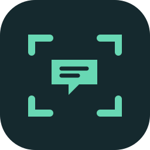
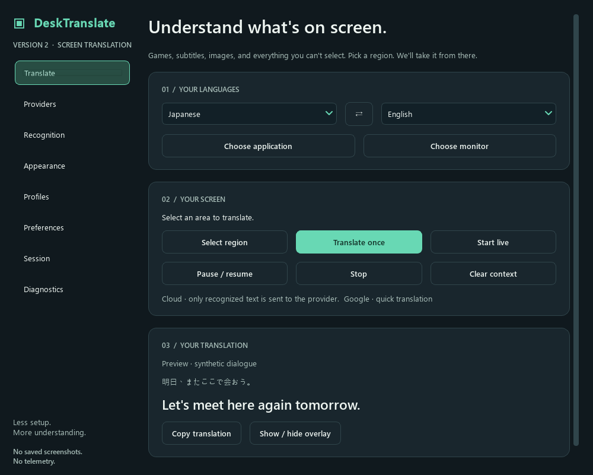
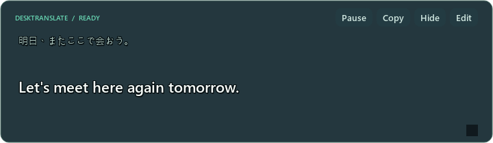
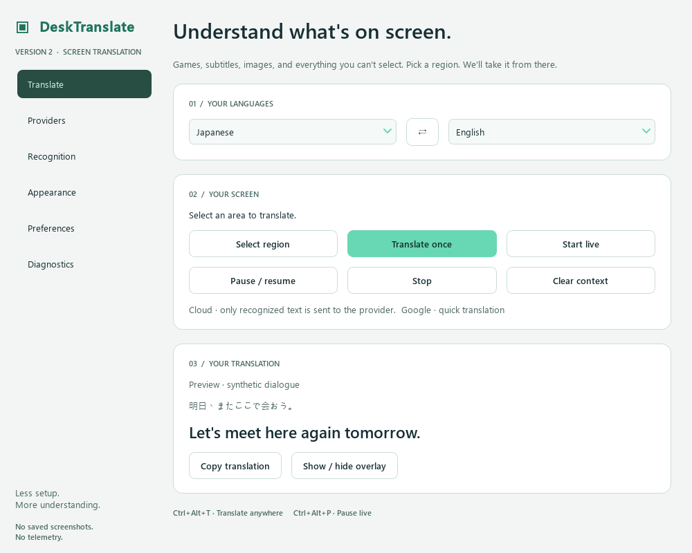

<p align="center"></p>

# DeskTranslate 2

**Understand what's on screen. Keep enjoying what's underneath.**

Translate the dialogue in a game, subtitles in a video, a menu, or text in an image. Press a shortcut, select a region, and read the translation in a quiet, customizable overlay.

[Download the Windows beta](https://github.com/DeskTranslate/DeskTranslate/releases) · [Getting started](#your-first-translation) · [Privacy](docs/privacy.md) · [Report a problem](https://github.com/DeskTranslate/DeskTranslate/issues/new/choose)

**V2 is the DeskTranslate revival:** a new Windows application with managed local OCR, contextual translation and an editable subtitle overlay. The 2.0.0b2 hardening pass adds window-following capture, full profiles and guided first-translation setup. **Stable release verdict: NOT READY.** Publisher signing and the remaining clean-machine, physical display, screen-reader and provider qualification gates are still outstanding.



## A new foundation for screen translation

- **Choose once or stay live.** Snip a region for a single result, or watch a dialogue box for changes. Static frames skip OCR; obsolete requests cannot overwrite newer text.
- **Follow your application.** Bind a normalized subtitle region to a chosen window's client area. It follows movement and resizing, waits while covered or minimized, and reconnects after a restart only if you enable it. This uses visible-screen capture; keep the region unobstructed.
- **Recognition runs locally.** Managed, verified RapidOCR/ONNX models replace executable-path setup. Optional Tesseract remains available for existing installations. Japanese, Korean, Chinese, English and Spanish fixtures are included in the test corpus.
- **Choose how to translate.** Start with keyless quick translation, connect a conventional API, or use contextual AI locally or in the cloud. OCR and translation are independent choices.
- **Context for dialogue.** AI providers receive bounded recent lines and an optional glossary. Natural, literal, subtitle and game styles help preserve tone and terminology.
- **An overlay that fits your content.** Editable subtitle presets, typography, colors, gradients, outlines, shadows, line limits, source/translation layout, position locking and click-through. Enter edit mode with `Ctrl+Alt+E`.
- **A setup for every story.** Save, load, update, duplicate, rename and exchange profiles for games and shows. Profiles include language, OCR, provider/model, glossary, context, shortcuts and overlay settings. Keys stay in the OS vault; imported profiles require a new local capture selection.
- **A first translation you can see.** Guided setup installs the right recognition pack and processes an authored sample with actual OCR and your chosen provider. Back, retry and Set up later remain available.
- **Built for everyday use.** Searchable languages/models, global shortcuts, tray controls, light/dark and Windows high-contrast support, previewed diagnostics, and explicit stable/beta update checks. Runtime failures pause translation without opening the main window over your game.
- **Privacy you can understand.** Screenshots remain in memory. Local AI keeps recognized text on your machine. Cloud services receive recognized text and configured context, never screenshots. API keys use the OS credential vault. No telemetry. An optional bounded session transcript stays in memory until you explicitly copy or export it.

## Install

DeskTranslate 2 is a **Windows x64 beta**, targeting Windows 10 2004 or later and Windows 11. Download the versioned `Setup-x64.exe` from the [release page](https://github.com/DeskTranslate/DeskTranslate/releases). Installation is per user and needs no administrator account. Python and Tesseract are not required.

For a portable installation, extract the **entire** portable ZIP and launch `DeskTranslate.exe`. Keep `_internal` beside the executable. Portable describes the executable distribution; settings and downloaded recognition models still use `%LOCALAPPDATA%\DeskTranslate`.

The beta binaries are **unsigned**. Verify their SHA-256 against `SHA256SUMS.txt` on the release page. Checksums detect changed files but do not establish publisher identity. Separate runtime/build SBOMs, a build provenance statement, library sources and third-party notices accompany new builds. Trusted Authenticode signing with RFC 3161 timestamps is required before stable promotion; no publisher certificate is currently available.

## Your first translation

1. Launch DeskTranslate and follow **Your first translation**. Choose your reading and translation languages; choose Japanese or Korean explicitly when reading those scripts.
2. Choose **Google · online · no API key** for simple setup, or use your configured provider. Google uses a public web endpoint whose availability is not guaranteed. Recognition stays local; the guide never silently switches providers.
3. Install the selected language pack and press **Translate sample**. Downloads show progress, support cancellation, and must pass SHA-256 verification. Setup is complete only after an actual successful sample or screen translation. You can reopen it in Preferences.
4. Press **Ctrl+Alt+T**, drag tightly around the text, and press **Enter**. **Escape** cancels. Resize a selection using its corners.
5. Read the overlay. For continuing dialogue, use **Ctrl+Alt+L** and select the dialogue area.

For a moving game or video window, choose **Choose application**, then **Region inside application** and select its subtitle area. Keep the area visible. A covered, minimized, missing or ambiguous target waits safely; it never falls back to another application's pixels. Fixed regions and entire-monitor one-shot capture remain available.

Use a tight text region for changing video backgrounds. DeskTranslate keeps the overlay outside that region to prevent it from translating itself. If a region leaves no space for an overlay, use a smaller region or one-shot mode; the result can appear in the main window.

| Action | Default shortcut |
|---|---|
| Select and translate once | Ctrl+Alt+T |
| Select and start live | Ctrl+Alt+L |
| Pause / resume | Ctrl+Alt+P |
| Stop | Ctrl+Alt+S |
| Reselect region | Ctrl+Alt+R |
| Show / hide overlay | Ctrl+Alt+O |
| Copy latest translation | Ctrl+Alt+C |
| Edit overlay | Ctrl+Alt+E |

Shortcuts are configurable and checked for conflicts. First-run setup adds Shift (then Win if needed) when another app owns a default shortcut; the welcome screen shows your assigned shortcut. Closing exits by default; keeping the app in the tray is an explicit preference.

## Make the overlay yours



Choose Midnight mint, Anime subtitles, Cinematic, Paper & ink, or High contrast in **Appearance**, then customize. Font family, size, weight, italic, text/source colors, separate text/background opacity, gradient direction, outline, shadow, spacing, padding, corner radius and alignment are editable. Position it at the top or bottom center, drag/resize it, or reset the layout.

Click-through lets a game receive mouse input. Edit mode temporarily restores interaction and pauses an active session; finish editing and resume when ready. A reduced-motion option disables the brief appearance fade. Long translations shrink within a bounded range and clip at the configured line limit; **Copy** retains the complete text. The main window also contains the full result.



## Translation providers

| Provider | Processing | Setup |
|---|---|---|
| Google quick translation | Cloud, conventional MT | No key; public endpoint with no availability guarantee |
| DeepL | Cloud, conventional MT | Your API key; Free/Pro API endpoint as appropriate |
| LibreTranslate | Your local or HTTPS server | Endpoint; optional key; server languages vary |
| OpenAI | Cloud, contextual AI | API key; native Responses recommended, Chat Completions available |
| Anthropic Claude | Cloud, native Messages API | API key; discover/select a model |
| Google Gemini | Cloud, native generateContent | API key; discover/select a compatible model |
| OpenRouter | Cloud, contextual AI | API key; searchable catalog with available price/context metadata |
| Ollama | Local, contextual AI | Start Ollama and install a model yourself |
| LM Studio | Local, contextual AI | Load a model and start its local API server |
| OpenAI compatible | Local or remote | Loopback HTTP or remote HTTPS base URL; optional key |

API providers may charge usage fees. Trial credits or free quotas are not promised. In **Providers**, select a service, enter a key if required, and **Save & test connection**. Choose a discovered model and **Apply translation settings**. Official provider links are available in the app. Model names are not permanently hardcoded.

Advanced endpoint/API controls are hidden until requested. Known embedding, image, audio and realtime-only models are excluded from text-model lists; unknown compatible models remain selectable with unverified support. Native OpenAI requests disable response storage and streaming; compatible servers retain Chat Completions. [Provider setup and recovery](docs/provider-setup.md) explains privacy, costs and common errors. Glossaries support previewed JSON/CSV exchange; imported terms remain a draft until Apply.

**Find local AI servers** probes Ollama and LM Studio on localhost. DeskTranslate does not download large LLMs or silently fall back from local to cloud. Start/load the server yourself, test it, choose a model, and apply. Translation quality and speed depend on that model and your hardware.

## What the beta has been checked against

Core algorithms, concurrent stale-result rejection, settings recovery, ten provider request/response contracts, model integrity, UI flows and privacy boundaries have automated tests. The packaged runtime has been checked for startup, assets, isolated OCR and native credential storage. A guarded desktop integration probe at 125% scaling captures synthetic dialogue and translates it. The installer and portable app are built with PyInstaller and Inno Setup.

The [production audit](docs/production-audit.md), [validation report](docs/validation.md) and [raw OCR benchmark](docs/ocr-benchmark.json) distinguish measured evidence from unqualified scenarios. Seven of nine synthetic fixtures have zero whitespace-normalized character error with original colors; Chinese punctuation/traditional-character errors remain. Typical warm CPU OCR on this host takes roughly 0.9–1.4 seconds; rapid subtitles may outpace it. Synthetic fixtures do not establish accuracy for every game or video.

## Current limits

- Regions stay within one monitor. Negative origins and mixed-scale coordinate transforms are tested; physical mixed-DPI, hot-plug and exclusive-fullscreen coverage still need a hardware matrix. Use windowed/borderless mode if capture is blank. Protected content cannot be promised.
- Auto recognition uses a Chinese/Latin family and is not universal. Choose the source script explicitly. Vertical reading order is experimental; curved/rotated/stylized text may fail.
- AI adapters have mocked contract coverage. Paid-account and local-model quality testing require your configured providers; no universal accuracy or compatibility claim is made.
- This beta ships local CPU OCR and visible-window following. Cloud OCR, vision uploads, production GPU inference, universal automatic script routing, multiple simultaneous regions, speech and persistent history are not shipped. DirectML and Windows Graphics Capture remain documented investigations.
- macOS/Linux source portability is unqualified. The separate legacy [Mac project](https://github.com/DeskTranslate/DeskTranslate-Mac) is not the DeskTranslate 2 release.

## Develop and build

Use **Python 3.12 x64 on Windows** for the qualified build. Application source accepts Python 3.12–3.14; those other interpreters need their own release qualification.

```powershell
py -3.12 -m venv .venv
.\.venv\Scripts\python -m pip install --require-hashes -r requirements-bootstrap.lock
.\.venv\Scripts\python -m pip install --require-hashes --no-build-isolation -r requirements-windows.lock
.\.venv\Scripts\python -m pip install --no-deps --no-build-isolation -e .
.\.venv\Scripts\python -m desktranslate
```

```powershell
.\.venv\Scripts\python -m pytest -q --basetemp=.test-tmp
.\.venv\Scripts\python -m ruff check src tests tools
.\.venv\Scripts\python -m ruff format --check src tests tools
.\.venv\Scripts\python -m mypy src
.\.venv\Scripts\python -m desktranslate --smoke-test
.\.venv\Scripts\python -m pip_audit --require-hashes --disable-pip -r requirements-windows.lock
.\.venv\Scripts\python tools/library_sources.py
.\.venv\Scripts\python tools/build.py --installer
```

Install [Inno Setup 6](https://jrsoftware.org/isinfo.php) and put `ISCC` on PATH or set `ISCC_PATH` to its verified compiler. Build outputs are in `dist/`: portable ZIP, per-user installer, runtime/build SBOMs, provenance and checksums. Version metadata comes from `desktranslate.__version__`; a mismatched tag fails the build. [Signing and release qualification](docs/release-checklist.md), [CONTRIBUTING](CONTRIBUTING.md), [architecture](docs/architecture.md), [troubleshooting](docs/troubleshooting.md), and [the original audit](docs/audit.md) explain the workflow. See [SECURITY](SECURITY.md) for private vulnerability reporting.

## License

DeskTranslate 2 is licensed under [MIT](LICENSE). Third-party libraries and downloaded OCR models retain their own licenses. Qt/PySide6 license notices and replaceable shared libraries are included in binary distributions; see [third-party attribution](docs/third-party.md).
