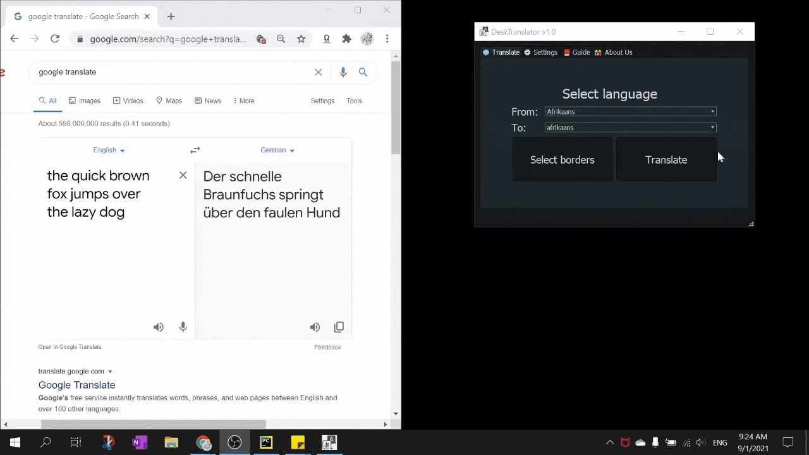
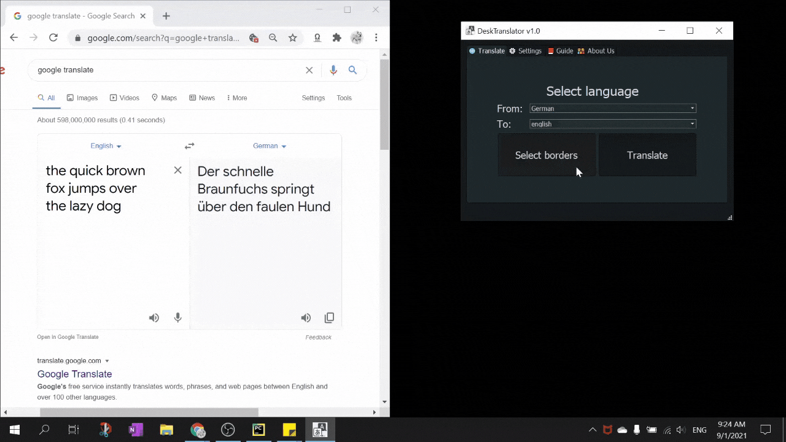
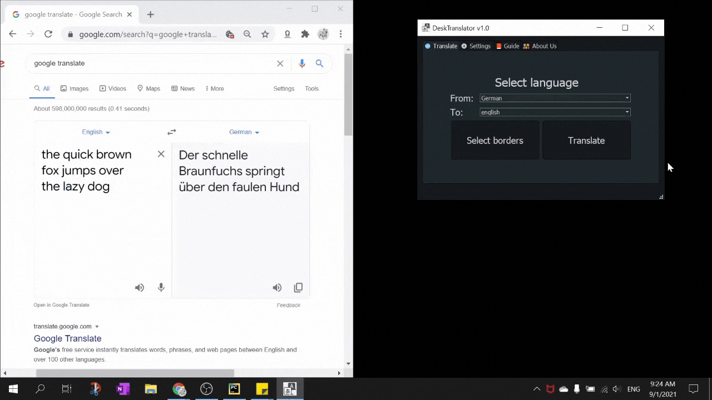
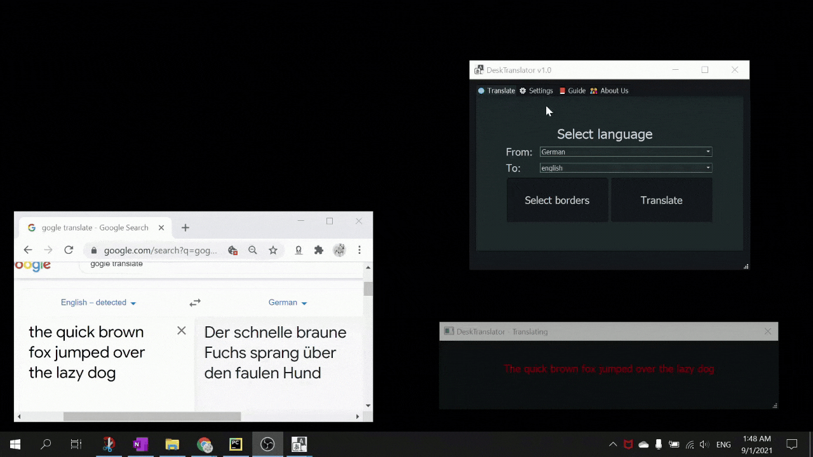
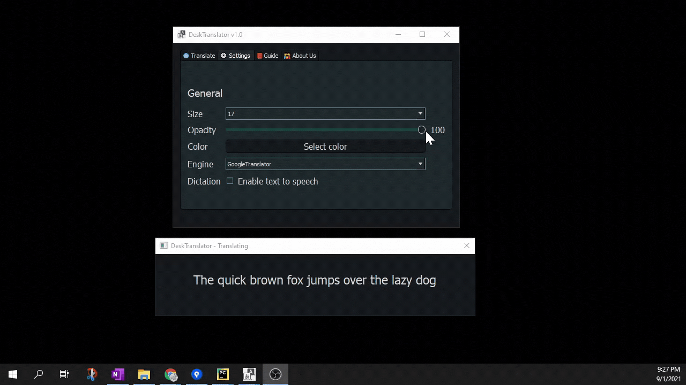
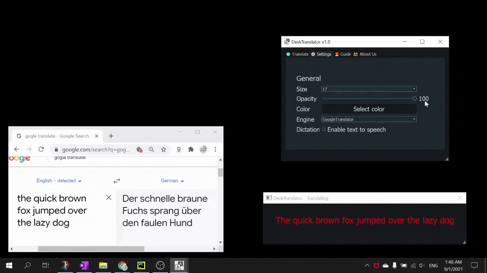
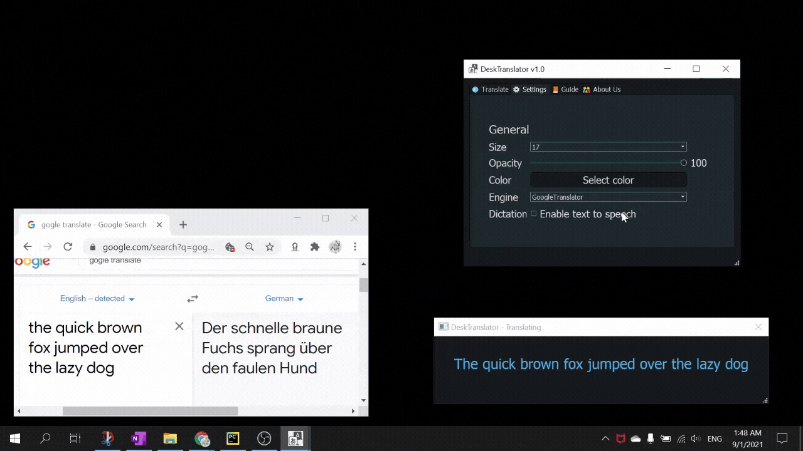
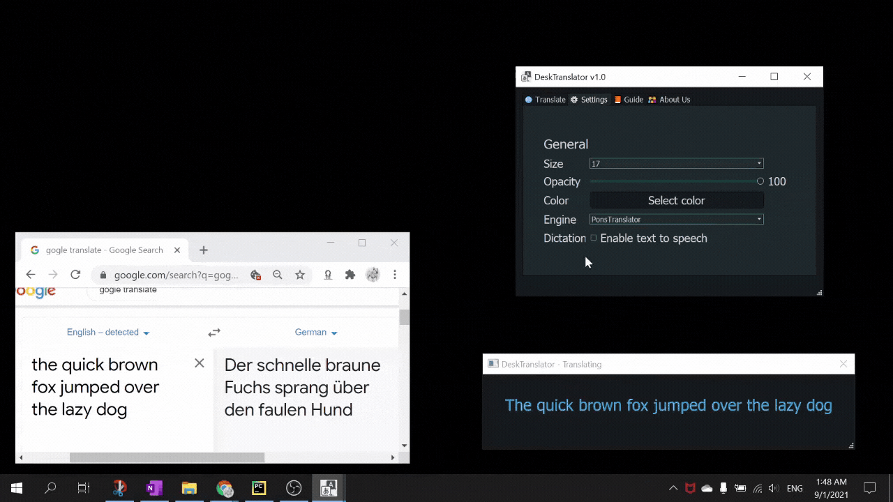
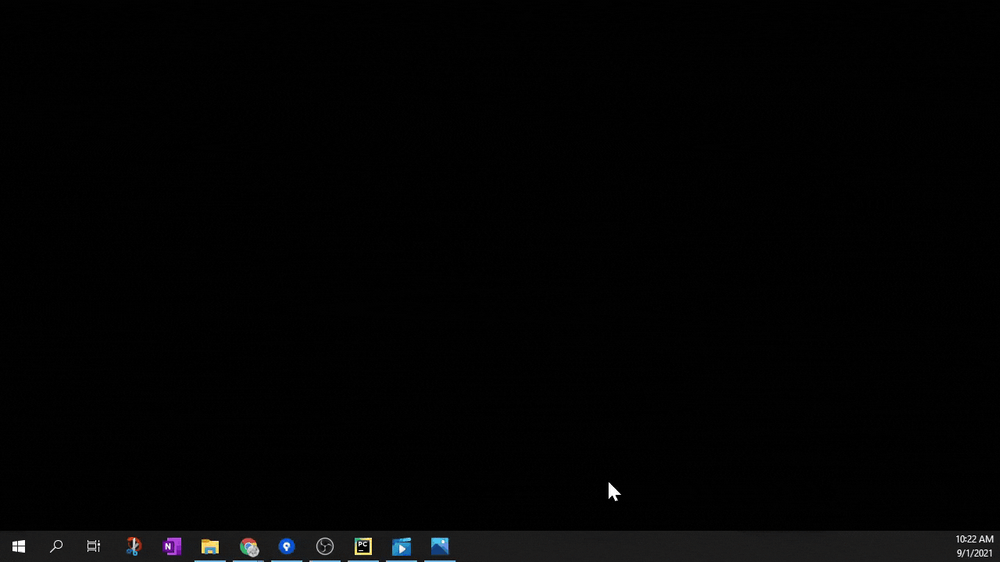
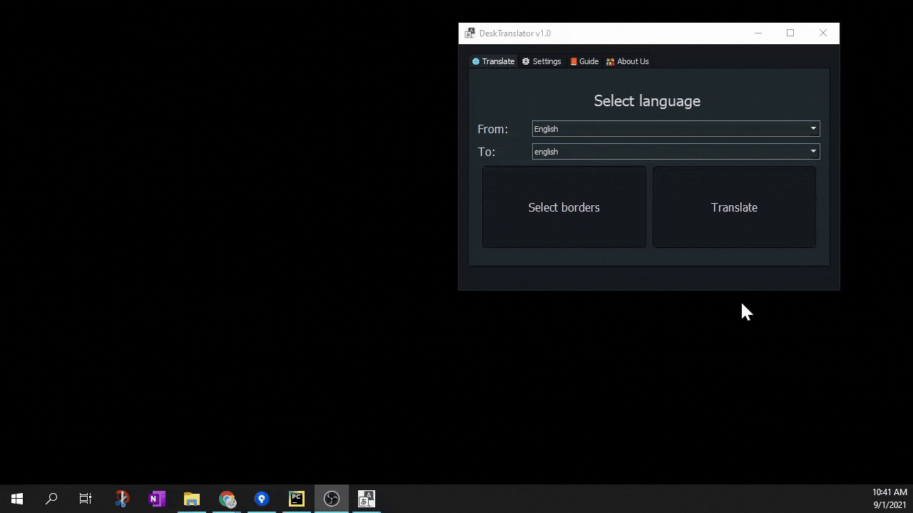

# DeskTranslate User Guide

Welcome to DeskTranslate, a live, seamless OCR translation tool right on your desktop!

:information_source:  [DeskTranslate main site](README.md)  

## Contents page

* [Introduction](#introduction)
* [Quick Start](#quick-start)
* [Features](#features)
  * [Translation](#translation)
    * [Selecting languages](#selecting-languages)
    * [Selecting Borders](#selecting-borders)
    * [Auto Translate](#auto-translate)
  * [Customization](#customization) 
    * [Font Size](#font-size)
    * [Translate Window Opacity](#translate-window-opacity)
    * [Text Color](#text-color)
    * [Translator Engine](#translator-engine)
    * [Narration](#narration)
  * [Bonus Features](#bonus-features)
    * [Splash Screen](#splash-screen)
    * [Text Box Resizing](#text-box-resizing)
* [FAQ](#faq)

## Introduction

DeskTranslate is a desktop application for translating foreign texts using optical character recognition. 

It has 3 main features:

* Real-Time translation
* Text2Speech
* Customizable font sizes and colours

:memo: Do note that DeskTranslate is currently only available in Windows.   

## Quick Start

1. To get started, download DeskTranslate at our main repo by clicking Code -> Download ZIP.

2. Ensure Python is install in your computer.

3. Using terminal, go to the directory where the repo is downloaded to. 

4. Download the libraries required:  
`pip install -r requirements.txt`

5. Visit [this link](https://github.com/UB-Mannheim/tesseract/wiki) to download Tesseract v5.0.0, in order 
for our program to work on your computer.

6. At the installation wizard, check all boxes to ensure that all language training data will be included for DeskTranslate. 

7. Next, enter the following command to start the program:
`python main.py`

## Features 

* DeskTranslate has a intuitive GUI that is quite easy to use, with a customizable display
* Included a splash screen, in-app user guide, and about us section as well

### Translation

#### Selecting Languages

Click the dropdown lists and either type in the first few characters of the language you are searching for or scroll down and click it to select.

#### Selecting Borders

Click on the `Select Borders` button on the Translate tab to start the selection. You can then draw a rectangle to indicate the where the text you would like to translate will be.

#### Auto Translate

After selecting the borders, click the `Translate` button on the Translate tab. The app will automatically begin the OCR and translation process, and the translated text will be regularly updated in the translation window.

### Customization
To improve accessibility, we have enabled the user to customize certain features of the app as well as enable text to speech.

#### Font Size

To increase the font size, click on the `Font` dropdown list in the `Settings` tab and select a font size.

#### Translate Window Opacity

If you want to overlay the translate window with the game you are playing, you can change the opacity of the window. Simply slide the `opacity` slider in the `Settings` tab.

#### Text Color

To change the color of the text in the translate window, click the select color button in the `Settings` tab. This will open up a color picker window. After selecting a color, click ok to save your change.

#### Translator Engine

DeskTranslate offers 4 different translation engines; GoogleTranslator, PonsTranslator, LingueeTranslator and MyMemoryTranslator. To select a translation engine, click on the `Engine` dropdown in the `Settings` tab and select an engine.

#### Narration

To assist the visually impaired, DeskTranslator features a built-in text-to-speech system that narrates the text in the translate window. To Activate it, simply tick `Enable text to speech` checkbox found at the bottom of the `Settings` tab.

### Bonus Features
Additional features we added to improve the look and feel of the application

#### Splash Screen

We added an animated splash screen to make the app look more profesional

#### Text Box Resizing

We enabled dynamic text box resizing to make it easier for the user to position and arrange the windows

## FAQ

**Q**: Is the app free to use?

**A**: Yes it is! 

**Q**: Do I need to have an internet connection for the app to work?

**A**: Yes, since the translation engines rely on API calls to online translators to work.

[Jump to top](#desktranslate-user-guide)
